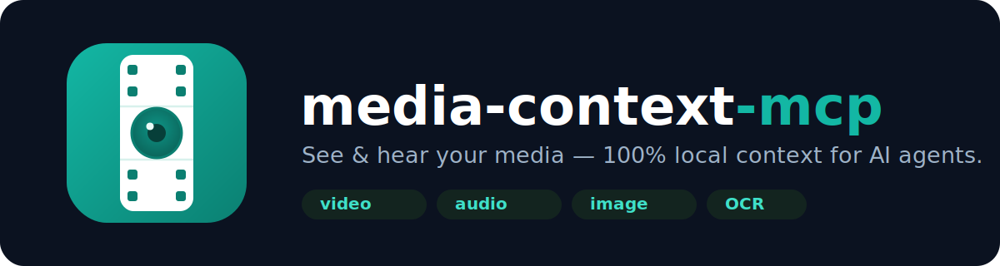

<p align="center">
  
</p>

<p align="center">
  <a href="https://www.npmjs.com/package/media-context-mcp"></a>
  <a href="https://github.com/vishalguptax/media-context-mcp/actions/workflows/ci.yml"></a>
  <a href="./LICENSE"></a>
  <a href="https://nodejs.org"></a>
</p>

<p align="center">
  <b>Let your AI assistant see and hear.</b> Turn any video, audio, or image into model-readable context — <b>100% locally</b>.
</p>

---

LLMs can't watch a video, listen to a recording, or read text inside a screenshot. **media-context-mcp** is an [MCP](https://modelcontextprotocol.io) server that closes that gap: it samples media into compact, low-token context — montage frames, speech transcripts, and on-screen OCR — and hands it to whatever model your editor already runs.

Everything runs on your machine via `ffmpeg`, `yt-dlp`, Whisper, and Tesseract. **No API keys. No cloud upload. No per-call cost.**

## Contents

- [Features](#features)
- [Quick start](#quick-start)
- [Install in your tool](#install-in-your-tool)
- [Requirements](#requirements)
- [Usage scenarios](#usage-scenarios)
- [Tool reference](#tool-reference)
- [Use as a library](#use-as-a-library)
- [How it works](#how-it-works)
- [Token tips](#token-tips)
- [Development](#development)
- [Open-core](#open-core)
- [License](#license)

## Features

- 🎬 **Video → visual context** — montage grids (cheap), individual stills, scene-change detection, or a dense filmstrip.
- 🗣️ **Audio → transcript** — local Whisper speech-to-text for files or podcast URLs.
- 🖼️ **Image → picture + text** — returns the image and optionally OCRs on-screen text.
- 🌐 **File or URL** — local paths, or any `yt-dlp`-supported URL (YouTube, Vimeo, X, direct files, 1000+ sites).
- 🔍 **OCR for screen recordings** — read exact UI labels, errors, and code instead of squinting at thumbnails.
- 🎞️ **Catch transient UI glitches** — `filmstrip` mode stacks near-native-fps frames to spot a flicker that lasts <1s.
- 🪙 **Token-aware** — montage tiling, frame caps, resolution control, and `webp`/`jpeg`/`png` output.
- 🔒 **Private & local** — media never leaves your machine; binaries spawned directly (no shell) with timeouts; temp files cleaned every call.
- 🧩 **Opt-in by default** — the cheap montage is the default; transcript, OCR, and filmstrip only run when asked.

## Quick start

```bash
# no install needed — runs on demand
npx -y media-context-mcp
```

Add it to your AI tool (below), then just ask:

> “Summarize `C:/demo/onboarding.mp4`.”
> “Read the error in this screen recording `~/Videos/bug.mp4` — use detail high + ocr.”
> “Transcribe `https://youtu.be/VIDEO_ID`.”

## Install in your tool

media-context-mcp is a standard **stdio MCP server**, so it works in any MCP-capable client. The launch command is always `npx -y media-context-mcp`.

> Optional binaries (Whisper, Tesseract) are auto-detected on `PATH`. GUI apps often launch with a minimal `PATH` — if so, point at them with the `WHISPER_BIN` / `TESSERACT_BIN` / `FFMPEG_BIN` / `YTDLP_BIN` env vars (see the Claude Desktop example).

<details open>
<summary><b>Claude Code (CLI)</b></summary>

```bash
claude mcp add media-context -- npx -y media-context-mcp
```
</details>

<details>
<summary><b>Claude Desktop</b></summary>

Settings → Developer → Edit Config (`claude_desktop_config.json`):

```json
{
  "mcpServers": {
    "media-context": {
      "command": "npx",
      "args": ["-y", "media-context-mcp"],
      "env": {
        "WHISPER_BIN": "/path/to/whisper",
        "TESSERACT_BIN": "/path/to/tesseract"
      }
    }
  }
}
```
</details>

<details>
<summary><b>Cursor</b></summary>

`~/.cursor/mcp.json` (global) or `.cursor/mcp.json` (project):

```json
{
  "mcpServers": {
    "media-context": { "command": "npx", "args": ["-y", "media-context-mcp"] }
  }
}
```
</details>

<details>
<summary><b>VS Code (GitHub Copilot — agent mode)</b></summary>

Create `.vscode/mcp.json` (VS Code uses the `servers` key):

```json
{
  "servers": {
    "media-context": { "command": "npx", "args": ["-y", "media-context-mcp"] }
  }
}
```

Open Chat → **Agent** mode; `analyze_media` shows up in the tools picker.
</details>

<details>
<summary><b>Cline / Roo (VS Code)</b></summary>

```json
{
  "mcpServers": {
    "media-context": { "command": "npx", "args": ["-y", "media-context-mcp"] }
  }
}
```
</details>

<details>
<summary><b>Codex CLI</b></summary>

`~/.codex/config.toml`:

```toml
[mcp_servers.media-context]
command = "npx"
args = ["-y", "media-context-mcp"]
```
</details>

<details>
<summary><b>Windsurf</b></summary>

`~/.codeium/windsurf/mcp_config.json`:

```json
{
  "mcpServers": {
    "media-context": { "command": "npx", "args": ["-y", "media-context-mcp"] }
  }
}
```
</details>

## Requirements

| Binary | Needed for | Install |
|--------|-----------|---------|
| `ffmpeg` + `ffprobe` | **required** — all media handling | `winget install Gyan.FFmpeg` · `brew install ffmpeg` · `apt install ffmpeg` |
| `yt-dlp` | URL sources | `pip install -U yt-dlp` · `winget install yt-dlp.yt-dlp` · `brew install yt-dlp` |
| `whisper` | audio transcripts | `pip install -U openai-whisper` |
| `tesseract` | OCR / on-screen text | `winget install UB-Mannheim.TesseractOCR` · `brew install tesseract` · `apt install tesseract-ocr` |

Only `ffmpeg` is required; the rest are optional and unlock their feature when present. Run the **`check_media_deps`** tool any time to see what's detected.

## Usage scenarios

You normally just talk to your assistant; it calls `analyze_media` with the right options. The JSON shows what runs under the hood.

**1. Summarize a video** — cheapest overview, one or two montage images.
```json
{ "source": "demo.mp4" }
```

**2. Read the UI text in a screen recording** — readable stills + exact on-screen text.
```json
{ "source": "bug.mp4", "detail": "high", "ocr": true,
  "context": "checkout flow, focus on the error dialog" }
```

**3. Transcribe audio or a podcast** — auto-detected; transcript only, no images.
```json
{ "source": "episode.mp3" }
```

**4. Analyze a screenshot** — the image plus its OCR'd text.
```json
{ "source": "screen.png", "ocr": true }
```

**5. Analyze a YouTube (or any) URL**
```json
{ "source": "https://youtu.be/VIDEO_ID", "transcript": true }
```

**6. Catch a transient UI glitch** — dense filmstrip cropped to the control; a sub-second flicker shows up as a frame whose value disagrees with the rest.
```json
{ "source": "slider-bug.mp4", "mode": "filmstrip",
  "startSec": 5.6, "endSec": 7.4, "fps": 12,
  "crop": { "x": 0, "y": 1730, "width": 1080, "height": 360 } }
```

## Tool reference

### `analyze_media`

Auto-detects media type and dispatches: **video** → frames/montage (+ optional transcript/OCR); **audio** → transcript; **image** → the picture (+ optional OCR). Returns a text summary, image blocks, and transcript/OCR text blocks as applicable.

| Param | Default | Description |
|-------|---------|-------------|
| `source` | — | Local file path (video/audio/image) or http(s) URL. |
| `context` | — | Optional note framing the analysis; echoed atop the summary. |
| `detail` | — | `high` = readable stills for screen recordings (frames + scale 900 + png); `low` = cheap montage. |
| `mode` | `sheet` | `sheet` · `frames` · `scenes` · `filmstrip`. |
| `format` | `webp` | `webp` (smallest) · `jpeg` · `png` (crisp text). |
| `maxFrames` | `30` | Upper bound on sampled frames over the window. |
| `grid` | `5` | Tiles per row/column for montage modes. |
| `scale` | `320` | Per-frame width in px before tiling. Lower = fewer tokens. |
| `sceneThreshold` | `0.4` | Scene-change sensitivity (`scenes` mode). |
| `fps` | auto | Explicit sampling rate; pair high (10–15) with `filmstrip`. |
| `crop` | — | `{x,y,width,height}` pixel rect — zoom into a UI region. |
| `stripRows` | `18` | Tiles stacked per image in `filmstrip` mode. |
| `startSec` / `endSec` | — | Restrict to a time window. |
| `transcript` | `false` | Also run Whisper. |
| `whisperModel` | `small` | `tiny` · `base` · `small` · `medium` · `large`. |
| `ocr` | `false` | Extract on-screen text via Tesseract. Implies `detail:high`. |
| `ocrLang` | `eng` | Tesseract language code(s), e.g. `eng+deu`. |
| `ocrPsm` | `3` | Page-segmentation: `3` auto · `6` block · `11` sparse. |
| `ocrMaxFrames` | `12` | Frames to OCR (full-res, independent of display images). |
| `maxDurationSec` | `3600` | Reject URL downloads longer than this. |
| `maxFileSizeMb` | `500` | Abort a URL download past this size. |

### `check_media_deps`

Reports availability of `ffmpeg`, `ffprobe`, `yt-dlp`, `whisper`, `tesseract` with install hints.

## Use as a library

```ts
import { analyzeMedia } from "media-context-mcp";

const result = await analyzeMedia({ source: "demo.mp4", ocr: true });
console.log(result.summary);
for (const img of result.images) {
  // img.base64 is ready to send to any vision model
}
```

`import { createServer } from "media-context-mcp/server"` returns the MCP server for a custom transport. A runnable example is in [`examples/try.mjs`](./examples/try.mjs):

```bash
node examples/try.mjs demo.mp4 --ocr --detail
```

## How it works

Models read images and text, not video. media-context-mcp samples the source with `ffmpeg`, tiles frames into a few downscaled montage images, and returns them as image blocks plus a short summary — so a 5-minute clip becomes 1–2 images instead of hundreds of stills. Audio is transcribed with Whisper; on-screen text is recovered with Tesseract from full-resolution frames; URLs are fetched with `yt-dlp`. Every call runs in a throwaway workspace that is deleted when it returns.

```
src/
  index.ts        bin entry — MCP stdio server
  server.ts       MCP wiring + tool schemas
  core.ts         analyzeMedia() orchestration (transport-agnostic)
  lib.ts          public library barrel
  types.ts        shared contracts
  schema.ts       input validation (shared by MCP + library)
  pipeline/       domain: media (classify) · source · ffmpeg · transcript · ocr
  system/         infra: exec · deps · bins · workspace
```

## Token tips

- Stay in `sheet` mode with a low `scale` (256–320) for a cheap gist.
- Use `frames` or a narrow `startSec`/`endSec` window only when you need detail on a moment.
- `scenes` is cheapest for slide decks and static screencasts.
- `webp` (default) is the smallest payload; use `png` only when crisp text matters.
- For screen recordings, prefer `ocr` — text is cheaper and more accurate than the model reading pixels.

## Development

```bash
npm install
npm run build
npm test            # 38 tests (ffmpeg/tesseract integration auto-skips if absent)
node dist/index.js  # run the stdio server
```

Contributions welcome — open an issue or PR.

## Open-core

The local engine in this repo is **free and open forever** — no artificial limits on duration, resolution, or features. Future **Pro** offerings (a hosted/team service, batch CI analysis, advanced auto-anomaly detection) may be built as separate products for those who want managed compute or workflow tooling; they will never paywall what's here.

## License

[Apache-2.0](./LICENSE) © Vishal Gupta
